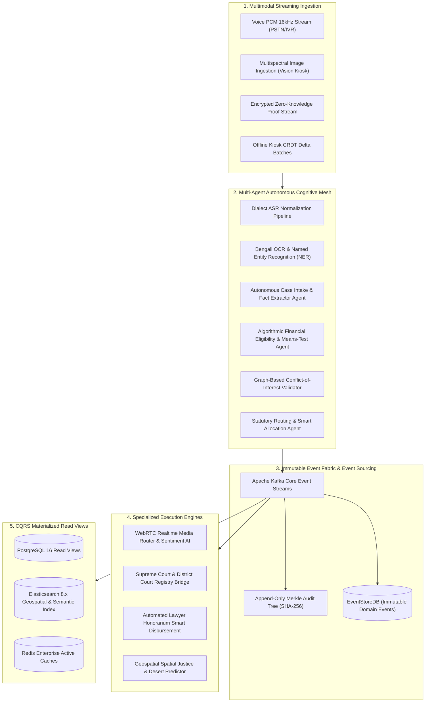
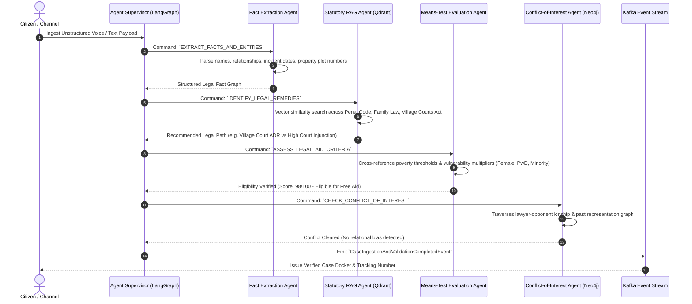
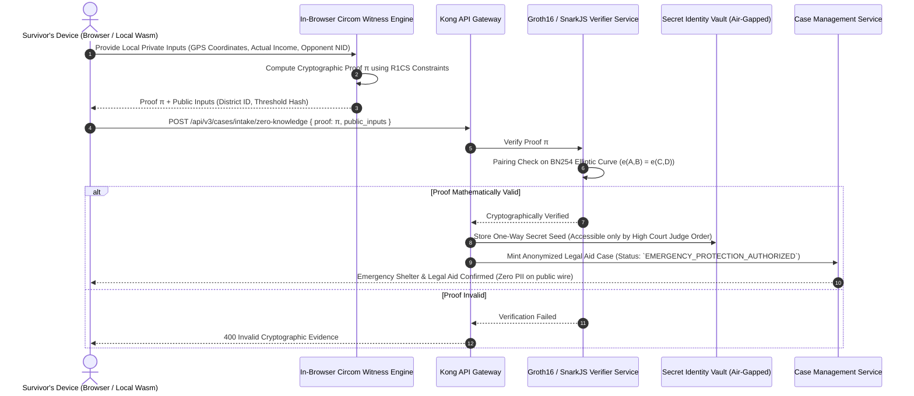
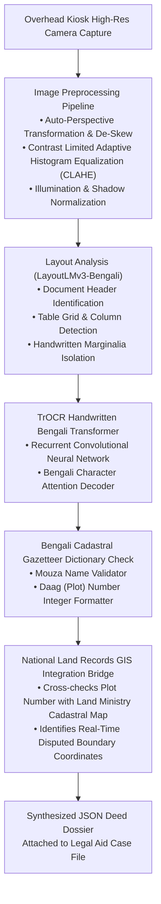
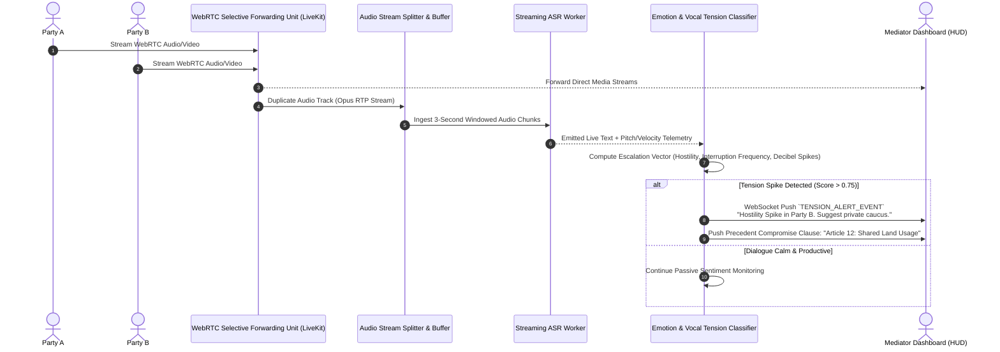
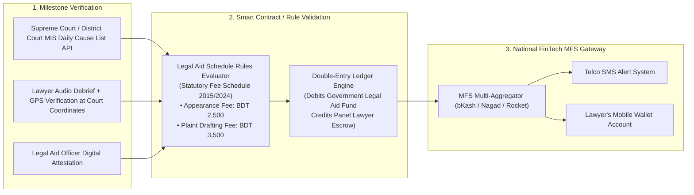
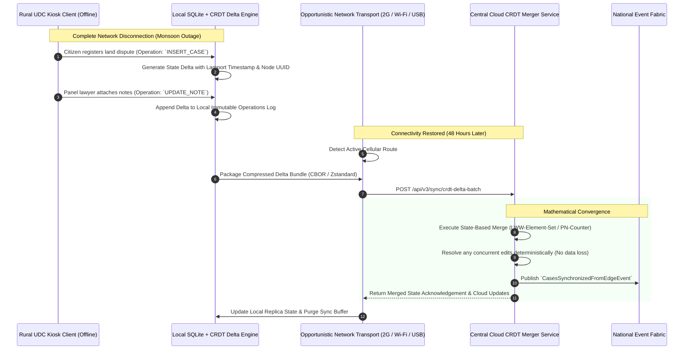
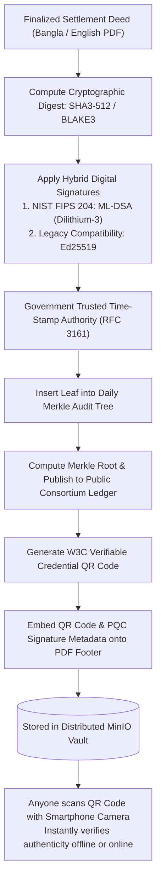

# ⚙️ Futuristic Application Flow Document
## Autonomous Agentic Pipelines, Event Sourcing & Cryptographic Infrastructure (DLA-Nexus Engine)

---

| **Field**                 | **Specification**                                                                 |
|---------------------------|-----------------------------------------------------------------------------------|
| **Project System**        | Accelerating Digital Legal Aid Services in Bangladesh (DLA-Nexus Engine)          |
| **Document Version**      | v3.0-Autonomous Engine & Reactive Pipelines Edition                               |
| **Focus**                 | Multi-Agent Orchestration, Event Sourcing Pipelines, Zero-Knowledge Cryptography  |
| **Execution Tier**        | Cloud-Native Kubernetes, Sovereign GPU Inference Nodes, Distributed Ledger Mesh   |
| **Standards Compliance**  | Reactive Streams, CloudEvents 1.0, W3C DID/VC, Post-Quantum Cryptography (NIST)    |

---

## 1. System Pipeline Ecosystem Overview

The DLA-Nexus platform replaces static linear request-response architectures with **asynchronous, agentic, event-driven reactive pipelines**. Below is the master application data and control pipeline flow across all operational subsystems:

---

## 2. Multi-Agent Cognitive Orchestration Pipeline Flow

When unstructured citizen input (voice memo, conversation, scanned petition) enters the system, an autonomous multi-agent pipeline processes, validates, extracts facts, checks conflict-of-interest, and assigns the legal aid docket within seconds.

---

## 3. Real-Time Bengali Dialect ASR & Voice Streaming Pipeline

This pipeline powers the conversational voice interface for illiterate and button-phone users across Bangladesh.

```mermaid
flowchart LR
    subgraph Audio_Capture [1. Audio Ingestion]
        TELCO_AUDIO["Cellular PSTN 8kHz G.711"]
        WEB_AUDIO["WebRTC Opus 48kHz / 16kHz"]
    end

    subgraph Resampling_Buffer [2. Ingest Buffer & Preprocessing]
        RESAMPLER["FFmpeg Realtime Stream Resampler -> 16kHz PCM"]
        VAD["Voice Activity Detector (Silero VAD)"]
        DENOISE["DeepFilterNet Neural Background Noise Suppressor"]
    end

    subgraph Inference_Pipeline [3. Transformer Neural Inference]
        WHISPER_BD["Fine-Tuned Whisper-Large-v3-Bengali"]
        DIALECT_ADAPTER["LoRA Adapters (Sylheti, Ctg, Noakhali, Rangpuri)"]
        PUNC_RESTORER["Bangla Punctuation & Diacritic Restorer"]
    end

    subgraph Semantic_Analysis [4. Intent & Entity Extraction]
        TOKENIZER["SentencePiece Bangla Byte-Pair Tokenizer"]
        INTENT_CLASSIFIER["Legal Intent Classifier (BERT-Bengali-Legal)"]
    end

    TELCO_AUDIO & WEB_AUDIO --> RESAMPLER --> VAD --> DENOISE
    DENOISE --> WHISPER_BD
    WHISPER_BD <--> DIALECT_ADAPTER
    WHISPER_BD --> PUNC_RESTORER --> TOKENIZER --> INTENT_CLASSIFIER
```

---

## 4. Zero-Knowledge Cryptographic Privacy Verification Pipeline

Protects gender-based violence (GBV) victims by verifying jurisdiction and poverty status without persisting sensitive raw identity, income documents, or live location in operational databases.

---

## 5. Vision-AI Historical Document Ingestion Pipeline

Parses century-old, handwritten land revenue documents (*Khatian/Porcha*), handwritten police FIRs, and physical deeds at Union Digital Centre kiosks.

---

## 6. Real-Time ODR WebRTC Audio Streaming & Sentiment Co-Pilot Pipeline

During virtual dispute resolution sessions, audio streams are analyzed in real time to alert the mediator of aggressive escalation and suggest precedent compromise terms.

---

## 7. Automated MFS Honorarium & Smart Escrow Pipeline

Panel lawyers often face months of bureaucratic delays in receiving compensation. DLA-Nexus executes micro-disbursements into mobile wallets upon automated verification of court appearances.

---

## 8. High-Resilience Edge-to-Cloud CRDT Synchronization Pipeline

Guarantees 100% data integrity for remote Union Digital Centres operating during cyclones, network outages, and seasonal infrastructure blackouts.

---

## 9. Post-Quantum Cryptographic Document Verification Pipeline

Ensures all settlement deeds, court decrees, and legal aid petitions remain tamper-proof and authentic against future quantum computing decryption capabilities.

---

## 10. Summary Matrix: Next-Gen Autonomous Capabilities

| Pipeline Flow | Traditional Web Flow | DLA-Nexus 3.0 Autonomous Engine |
|:---|:---|:---|
| **Intake Pipeline** | Synchronous REST POST of form inputs | Multi-agent autonomous speech, dialect, and vision parsing |
| **Data Consistency** | Centralized RDBMS requiring continuous internet | Resilient State-based CRDTs with 14-day offline autonomy |
| **Privacy Protection** | Plain text PII in SQL tables with basic passwords | Zero-Knowledge Proofs (zk-SNARKs) + Post-Quantum Cryptography |
| **Dispute Resolution** | Physical meetings with handwritten paperwork | Spatial WebRTC ODR with AI de-escalation sentiment radar |
| **Financial Settlement**| Months of manual treasury paper warrants | Automated MFS smart micro-disbursements upon court API verify |
| **System Auditability** | Standard server access logs (editable by admins) | Immutable Merkle Audit Trees and verifiable QR credentials |

---

*Application Flow Approved for Autonomous, Resilient, and Secure Legal Engineering*  
*Accelerating Digital Legal Aid Services in Bangladesh Project (EU / DBLA / UNDP)*
