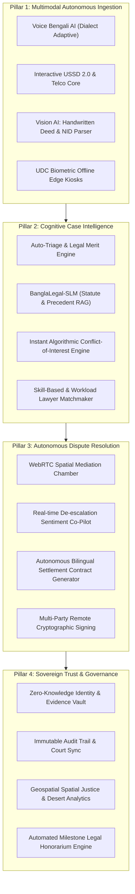
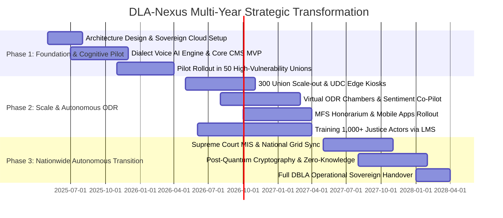

# 🌌 Product Requirements Document (PRD) — Next-Gen AI & Web3 Edition
## Autonomous & Scalable Digital Legal Aid Infrastructure (DLA 3.0)
### *Accelerating Digital Legal Aid Services in Bangladesh (2025–2028 & Beyond)*

---

| **Field**                 | **Specification**                                                                 |
|---------------------------|-----------------------------------------------------------------------------------|
| **Project Codename**      | **DLA-Nexus (Next-Gen Digital Legal Aid Ecosystem)**                              |
| **Document Version**      | v3.0-Futuristic Enterprise Edition                                                |
| **Status**                | Approved Baseline / Strategic Vision Document                                     |
| **Funding Partner**       | European Union (EU) — USD 3.24 Million + Future-Tech Scalability Grants           |
| **Executing Entity**      | Directorate of Bangladesh Legal Aid (DBLA), Ministry of Law, Justice & Parliamentary Affairs (MoLJPA) |
| **Technical Partner**     | United Nations Development Programme (UNDP Bangladesh)                            |
| **Strategic Horizon**     | 2025 – 2030 (Phased rollout with Post-2028 Autonomous Handover)                   |
| **Beneficiary Target**    | 682,500+ Direct Vulnerable Beneficiaries across 300 Pilot Unions (Scaling to 64 Districts) |
| **Project Leadership**    | Jinbo Choi, Project Manager — `jin.choi@undp.org`                                 |

---

## 1. Executive Summary & Futuristic Paradigm Shift

The **DLA-Nexus** initiative is an AI-augmented, privacy-preserving, decentralized legal aid platform. In Bangladesh, where over **7.5 million cases clog the judicial pipeline** and vulnerable demographics face structural, geographic, linguistic, and financial barriers, traditional digital forms are insufficient.

DLA-Nexus leaps over conventional digitization by fusing:
1. **Generative Voice-First Bengali AI Agents** capable of regional dialect comprehension (Chittagonian, Sylheti, Rangpuri, Noakhali) enabling 100% illiterate and button-phone populations to interact naturally.
2. **Zero-Knowledge Privacy Vaults (zk-SNARKs)** to protect victims of Gender-Based Violence (GBV) and ethnic minorities without exposing identity or physical coordinates.
3. **Autonomous Predictive Legal Triage & Micro-ODR (Online Dispute Resolution)** powered by Legal-SLMs (Small Language Models) fine-tuned on the Laws of Bangladesh.
4. **Verifiable Tamper-Proof Audit Trails (Merkle Trees & Consortium Ledger)** ensuring incorruptible evidence custody from Union Digital Centres (UDCs) to the Supreme Court.
5. **Geospatial Predictive Justice Analytics** using satellite socioeconomic data to proactively predict legal deserts and deploy mobile legal aid units before disputes escalate.

---

## 2. Core Problem Space & 2030 Transformation Vectors

```
┌─────────────────────────────────────────────────────────────────────────────────────────────────┐
│                                  SYSTEMIC PARADIGM SHIFT                                        │
├──────────────────────────────────────┬──────────────────────────────────────────────────────────┤
│ CURRENT BOTTLENECKS (2025)           │ NEXT-GEN DLA-NEXUS CAPABILITY (2026–2030)                 │
├──────────────────────────────────────┼──────────────────────────────────────────────────────────┤
│ 7.5M+ Pending backlog in courts      │ 40% disputes diverted to Autonomous AI-Assisted ODR      │
│ Low literacy impedes web form intake │ Voice-driven conversational Bengali AI on feature phones │
│ GBV victims fear public exposure     │ Zero-Knowledge Identity (ZKP) & encrypted safety vaults   │
│ Fragmented paper & manual referral   │ Smart Dynamic Referral Graphs across Union-Upazila-Dist. │
│ Panel lawyers suffer payout delays   │ Automated Milestone Smart-Vouchers via MFS (bKash/Nagad) │
│ Opaque case progress tracking        │ Real-time WhatsApp/SMS Conversational AI Status Bot      │
│ Isolated rural Union Digital Centres │ Offline-First Edge AI Kiosks with peer-to-peer sync      │
└──────────────────────────────────────┴──────────────────────────────────────────────────────────┘
```

---

## 3. High-Level System Architecture & Pillars



---

## 4. Futuristic User Personas & Autonomous Interaction Models

### 4.1 Beneficiary Personas (Human-Centric & Inclusive)

#### Persona A: Rokeya Begum (Rural Woman, Illiterate, Feature Phone User)
- **Profile**: 38, Kurigram district; land eviction threat following husband's abandonment; owns 2G button phone.
- **DLA-Nexus Experience**: Dials toll-free voice code `16430` or sends missed call. An autonomous Bangla Voice Agent calls back in local dialect, gathers facts conversationally, runs eligibility scoring, generates a case dossier, registers the case, and dispatches a secure voice alert to the Upazila Legal Aid Officer.

#### Persona B: Santona Murmu (Ethnic Minority Indigenous Youth)
- **Profile**: 21, Dinajpur; land encroachment dispute; speaks native dialect and conversational Bangla; smartphone user.
- **DLA-Nexus Experience**: Opens the lightweight Progressive Web App (PWA). Interacts with an interactive audio-visual chatbot, scans grandfather's 1965 handwritten Bengali land deed. Vision-AI extracts plot numbers, checks revenue land records, and matches him with an indigenous panel attorney.

#### Persona C: Shampa Akhter (Survivor of Domestic Abuse)
- **Profile**: 27, Gazipur; urgent protection order required; under surveillance by abusive family.
- **DLA-Nexus Experience**: Uses a hidden "Calculator/Utility" web micro-view. Generates a **Zero-Knowledge Evidence Dossier** that obscures her live physical address while proving immediate domestic abuse risk. Instant emergency shelter referral is triggered without alerting perpetrators.

### 4.2 Operator & Justice Actor Personas

#### Persona D: Adv. Anisur Rahman (Panel Lawyer)
- **Profile**: 44, District Bar Association; handles 60 concurrent legal aid cases.
- **DLA-Nexus Experience**: Receives AI-synthesized case briefs with automated statutory cross-references (Code of Criminal Procedure / Civil Court Act). Court hearing notes are dictated directly via voice-to-text; filing deadlines sync with District Court calendar; milestone completion triggers automated honorarium release via mobile wallet.

#### Persona E: Sharmin Sultana (Special Community Mediator)
- **Profile**: 52, Trained Union Parishad Mediator.
- **DLA-Nexus Experience**: Runs low-bandwidth Virtual Mediation Sessions. An AI Co-Pilot monitors dialogue sentiment, highlights points of consensus, suggests equitable land demarcation formulas based on Muslim/Hindu inheritance law, and drafts a binding compromise decree.

---

## 5. Next-Gen Functional Specifications (P0 – P2)

### 5.1 Autonomous Intake & Cognitive Interface Engine

| Req ID | Capability Specification | Architecture & Algorithmic Design | Priority |
|:---|:---|:---|:---:|
| **F-INT-101** | **Dialect-Adaptive Bengali Voice AI Agent** | Self-hosted acoustic models fine-tuned on 8 divisional dialects. Real-time voice pipeline (ASR -> LLM -> TTS) running with sub-800ms latency. Supports telephone IVR and smartphone audio input. | **P0** |
| **F-INT-102** | **Vision AI Document & Handwriting Parser** | Custom transformer-based OCR trained on handwritten historical Bengali revenue records (Porcha), land deeds, police FIRs, and NID cards with 94%+ character accuracy. | **P0** |
| **F-INT-103** | **Zero-Knowledge Vulnerability Vault** | Allows victims of domestic violence to verify legal aid financial eligibility without revealing exact residential coordinates or personal identifiable details on public dockets. | **P0** |
| **F-INT-104** | **Offline-First CRDT Kiosk Mode** | Union Digital Centre client operating offline for up to 14 days using Conflict-Free Replicated Data Types (CRDTs); auto-syncs via encrypted mesh or low-speed 2G cellular. | **P0** |
| **F-INT-105** | **Conversational WhatsApp / Telegram Legal Assistant** | Official verified WhatsApp bot enabling conversational application, document photo submission, and live status querying via end-to-end encrypted messaging. | **P1** |

---

### 5.2 Cognitive Case Engine & Legal-SLM Triage

| Req ID | Capability Specification | Architecture & Algorithmic Design | Priority |
|:---|:---|:---|:---:|
| **F-CSE-201** | **Automated Legal Merit & Track Classifier** | Evaluates case descriptions against statutory provisions (Legal Aid Services Act 2000, Village Courts Act 2006). Classifies case into: (a) Immediate ODR, (b) Village Court Referral, (c) District Court Litigation, (d) Emergency Protection Order. | **P0** |
| **F-CSE-202** | **Algorithmic Conflict-of-Interest Shield** | Graph database (Neo4j) cross-referencing party names, familial relationships, opposing counsel history, and district court rosters to block biased lawyer assignment within 50ms. | **P0** |
| **F-CSE-203** | **Predictive Resolution & Case Duration Engine** | Machine learning model trained on anonymized historical judicial records providing realistic timeframes, court hearing frequency estimates, and probability of mediation success. | **P1** |
| **F-CSE-204** | **Autonomous Legal Brief & Petition Synthesizer** | RAG pipeline grounded on Supreme Court precedents and statutory acts that synthesizes initial plaint/written statement drafts for panel lawyers in Bangla. | **P1** |

---

### 5.3 Next-Gen Online Dispute Resolution (ODR) & Virtual Chambers

| Req ID | Capability Specification | Architecture & Algorithmic Design | Priority |
|:---|:---|:---|:---:|
| **F-ODR-301** | **Adaptive Low-Bandwidth WebRTC Mesh** | Dynamic bitrate negotiation capable of maintaining crisp audio and smooth video at connections as low as 45 kbps, optimized for 3G/2G rural edges. | **P0** |
| **F-ODR-302** | **Real-Time Mediation Co-Pilot & Sentiment Analyzer** | Live speech-to-text analyzing tension indices; alerts mediator of hostile spikes; offers AI-generated compromise options based on precedent settlements. | **P1** |
| **F-ODR-303** | **Dynamic Bilingual Settlement Drafting** | Automatically generates legally binding mediation settlement deeds (*Solenama*) simultaneously in formal judicial Bengali and English. | **P0** |
| **F-ODR-304** | **Decentralized Cryptographic Signing** | Multi-party remote signing leveraging PKI digital signatures, SMS OTP cryptographic binding, and optional voice-biometric consent timestamping. | **P0** |

---

### 5.4 Spatial Justice Analytics & Executive Cockpit

| Req ID | Capability Specification | Architecture & Algorithmic Design | Priority |
|:---|:---|:---|:---:|
| **F-DASH-401** | **Predictive Spatial Justice Heatmap** | Integrates GIS boundary data across 300 pilot unions with poverty indices, satellite night-light metrics, and crime statistics to identify emerging legal deserts. | **P1** |
| **F-DASH-402** | **Real-Time Backlog Depletion Simulator** | Predictive dashboard for MoLJPA & Supreme Court showing how case diversion into Village Courts and ODR reduces backlog velocity in District Courts. | **P1** |
| **F-DASH-403** | **Automated Donor & EU M&E Verification Hub** | Real-time immutable KPI engine providing continuous, verifiable auditable feeds of beneficiary outreach, gender quotas (≥50% female), and fund utilization. | **P0** |
| **F-DASH-404** | **Automated Lawyer Milestone Honorarium Disbursement** | Micro-payment trigger releasing legal aid fees directly to panel lawyers' MFS accounts (bKash/Nagad/Rocket) upon digital verification of court appearances. | **P1** |

---

## 6. Non-Functional Hyper-Performance Benchmarks

```
┌───────────────────────────────────────────────────────────────────────────────────────┐
│                           SYSTEM CAPABILITY TARGETS (2025-2028)                       │
├─────────────────────────┬─────────────────────────┬───────────────────────────────────┤
│ METRIC                  │ TRADITIONAL BENCHMARK   │ DLA-NEXUS 3.0 SPECIFICATION       │
├─────────────────────────┼─────────────────────────┼───────────────────────────────────┤
│ Concurrent Peak Users   │ 500 sessions            │ 50,000+ Concurrent Sessions       │
│ Voice ASR Latency       │ 3.5 – 5.0 seconds       │ < 850 ms (Edge-Optimized)         │
│ API P99 Response Time   │ 1,200 ms                │ < 150 ms globally across BD       │
│ Offline Kiosk Retention │ None (Requires Net)     │ 14 Days Full Local Offline Autonomy│
│ System Availability     │ 98.0%                   │ 99.95% Fault-Tolerant Uptime      │
│ Data Encryption         │ TLS 1.2 / Plain DB      │ Post-Quantum Safe + AES-256 GCM   │
│ Accessibility           │ Basic Web View          │ WCAG 2.2 AAA + Dialect Voice UI   │
│ Recovery Time (RTO)     │ 24 Hours                │ < 15 Minutes (Multi-Zone DR)      │
│ Recovery Point (RPO)    │ 24 Hours                │ < 10 Seconds (Sync Replication)   │
└─────────────────────────┴─────────────────────────┴───────────────────────────────────┘
```

---

## 7. Phased Implementation & Quantum Leap Roadmap



---

## 8. Strategic Risks, Geopolitical & Ethical Safeguards

| Risk Category | Threat Analysis | Futuristic Counter-Measures & Safeguards |
|:---|:---|:---|
| **Algorithmic Bias in AI Triage** | Model might disenfranchise marginalized social groups or favor patriarchal viewpoints. | **Ethical AI Oversight Board**: Strict synthetic fairness testing; human-in-the-loop validation for 100% of rejections; open auditability of training weights. |
| **Connectivity Collapse in Rural Zones** | Cyclones, floods, and infrastructure failures cutting off remote Unions. | **Hybrid Satellite-Cellular Mesh & Offline CRDT Kiosks**: Solar-backed local storage at UDCs that seamlessly buffer and sync when connectivity restores. |
| **Digital Exclusion of Elderly & Illiterate** | Sophisticated screens alienating illiterate citizens. | **Pure Voice & Physical Kiosk Assisted Pathways**: Zero screen dependency. Citizens can access full justice services purely through speech and UDC intermediaries. |
| **Data Sovereignty & Legal Integrity** | Sensitive judicial evidence vulnerable to external cyber threats. | **Bangladesh Sovereign Cloud Deployment**: Strict zero-foreign-export data residency; physical HSM (Hardware Security Module) protection of encryption keys. |

---

*PRD Approved for Next-Gen Technical Architecture Execution*  
*United Nations Development Programme (UNDP) & Directorate of Bangladesh Legal Aid (DBLA)*
