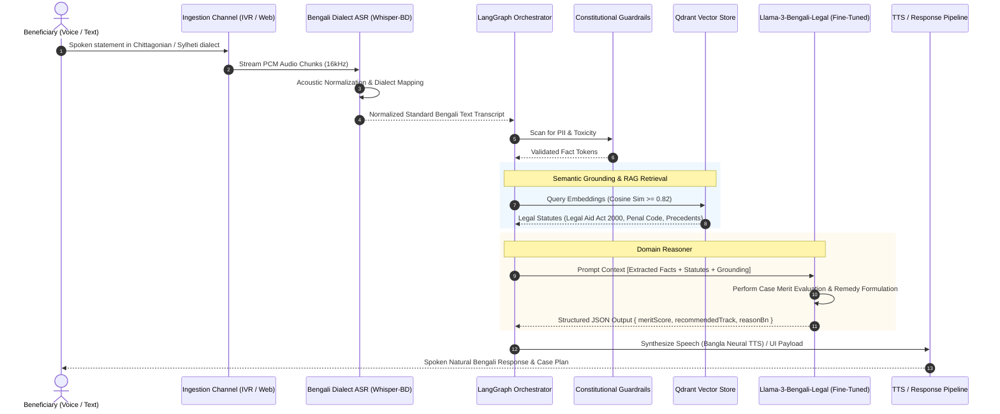

# ⚡ Technical Requirements Document (TRD) — Hyper-Scale & AI-Native Edition
## Autonomous & Scalable Digital Legal Aid Infrastructure (DLA-Nexus Engine)

---

| **Field**                 | **Specification**                                                                 |
|---------------------------|-----------------------------------------------------------------------------------|
| **System Architecture**   | Event-Driven Microservices, CQRS, Event Sourcing, Zero-Trust Sovereign Cloud      |
| **Document Version**      | v3.0-HyperScale Engine Specification                                              |
| **Target Infrastructure** | National Data Center (BCC) / Sovereign Multi-Zone Kubernetes Infrastructure        |
| **Compliance Level**      | Post-Quantum Cryptographic Ready, OWASP Top 10 API, ISO 27001, GDPR/UNDP Standard |
| **Document Scope**        | Deep Engineering Blueprints, Schemas, Network Meshes, ML/AI Pipelines, Resiliency |

---

## 1. Next-Generation System Topology & Cloud Mesh

The DLA-Nexus architecture is engineered as an **AI-Native, Event-Driven, Cloud-Agile platform**. It decouples command processing from query reads via CQRS and Event Sourcing, ensuring that high-volume public querying or rural intake surges never degrade core case management transactions.

```mermaid
flowchart TB
    subgraph INGRESS_SECURITY [Edge Ingress & Zero-Trust Perimeter]
        DNS["GeoDNS Anycast Layer"]
        WAF["Web Application Firewall (OWASP & DDoS Mitigation)"]
        KONG["Kong Enterprise API Gateway (Service Mesh Ingress)"]
        ENVOY["Envoy Sidecar Mesh (Mutual TLS 1.3 / SPIFFE/SPIRE)"]
    end

    subgraph CLIENT_TIER [Multi-Channel Client Matrix]
        WEB_APP["React 19 + TypeScript Micro-Frontends (Wasm Secured)"]
        PWA_EDGE["Offline-First PWA (IndexedDB + CRDT Sync Engine)"]
        TELCO_CORE["Telco USSD / SMPP Gateway Adapter"]
        VOICE_IVR["FreeSWITCH / WebRTC Bengali Voice Ingestion Gateway"]
        ADMIN_COCKPIT["Executive Spatial Analytics Dashboard"]
    end

    subgraph COGNITIVE_AI_TIER [Cognitive AI & NLP Inference Cluster]
        ASR_ENGINE["Bengali Dialect Speech-to-Text (Whisper Fine-Tuned)"]
        TTS_ENGINE["Expressive Bengali Neural TTS (FastSpeech2)"]
        RAG_ORCH["LangGraph Multi-Agent Orchestrator"]
        LEGAL_LLM["Sovereign Bengali Legal-SLM (Llama-3-Bengali-Legal 8B/70B)"]
        VECTOR_DB[("Qdrant / Milvus Vector Database (Dense & Sparse)")]
        VISION_OCR["Transformer-based Bengali OCR (Historical Deeds & NID)"]
    end

    subgraph MICROSERVICES_CORE [Event-Driven Microservices Layer]
        AUTH_MFA["Auth & Decentralized Identity Service (DID / Keycloak)"]
        CASE_CORE["Case Command Processing Service (Event Sourced)"]
        CASE_QUERY["Case Query Service (Optimized Read Projections)"]
        ODR_ENGINE["ODR Engine & WebRTC SFU Media Router (LiveKit/Jitsi)"]
        DOC_VAULT["Zero-Knowledge Cryptographic Document Vault"]
        NOTIF_DISP["Multichannel Intelligent Dispatcher (SMS/WhatsApp/Push)"]
        REFERRAL_GRAPH["Jurisdictional Referral Graph Engine (Neo4j)"]
        FINTECH_ESCROW["Automated MFS Lawyer Honorarium Engine"]
    end

    subgraph EVENT_FABRIC [High-Throughput Messaging & Event Sourcing]
        KAFKA_CLUSTER["Apache Kafka Event Streaming Fabric (KRaft Mode)"]
        SCHEMA_REG["Confluent Schema Registry (Protobuf / Avro)"]
    end

    subgraph PERSISTENCE_TIER [Polyglot Distributed Data Stores]
        PG_CLUSTER[("PostgreSQL 16 HA Cluster (Patroni + TimescaleDB)")]
        REDIS_MESH[("Redis Enterprise Cluster (Active-Active Memory Grid)")]
        ES_SEARCH[("Elasticsearch 8.x Cluster (Bangla Morphological Analyzer)")]
        NEO4J_GRAPH[("Neo4j Enterprise (Kinship, Conflict & Court Graph)")]
        S3_STORAGE[("MinIO Distributed Object Storage (S3-Compliant, Encrypted)")]
        LEDGER_DAG[("Append-Only Merkle Audit Tree (Verifiable Tamper-Proof)")]
    end

    CLIENT_TIER --> DNS --> WAF --> KONG --> ENVOY
    KONG --> MICROSERVICES_CORE
    KONG --> COGNITIVE_AI_TIER

    MICROSERVICES_CORE <--> EVENT_FABRIC
    COGNITIVE_AI_TIER <--> EVENT_FABRIC

    CASE_CORE --> KAFKA_CLUSTER
    KAFKA_CLUSTER --> CASE_QUERY
    KAFKA_CLUSTER --> NOTIF_DISP
    KAFKA_CLUSTER --> LEDGER_DAG

    MICROSERVICES_CORE --> PG_CLUSTER & REDIS_MESH & ES_SEARCH & NEO4J_GRAPH & S3_STORAGE
    COGNITIVE_AI_TIER --> VECTOR_DB
```



---

## 2. Advanced Technology Stack Matrix

| Architectural Layer | Production Standard | Enterprise Justification |
|:---|:---|:---|
| **Frontend Runtime** | React 19, TypeScript 5.x, Tailwind CSS | Modular Micro-Frontends, zero-hydration latency, full SSR/SSG parity. |
| **Client-Side Security** | WebAssembly (Rust-compiled Wasm) | Executes client-side AES-256-GCM encryption & zk-SNARK witness generation in-browser. |
| **API Gateway & Mesh** | Kong Enterprise + Istio / Envoy | Global rate-limiting, mTLS zero-trust communication between microservices, circuit breaking. |
| **Backend Core** | Node.js (NestJS) + Go (Golang) | NestJS for domain business logic; Go for high-concurrency event consumers and WebRTC media proxies. |
| **Event Stream Core** | Apache Kafka (KRaft mode) | Durable event-sourcing with >100,000 msg/sec throughput, fault-tolerant replayability. |
| **Relational / OLTP** | PostgreSQL 16 with TimescaleDB & pgvector | High-performance relational state, time-series audit tracking, and embedded vector search. |
| **Vector Engine** | Qdrant / Milvus (Distributed) | Dense embeddings (HuggingFace Bengali-Legal-BERT) for statutory & precedent RAG search. |
| **Graph Database** | Neo4j Enterprise | Resolves conflict-of-interest checks, relational kinship networks, and jurisdictional referrals. |
| **Memory Grid** | Redis Enterprise Cluster 7.2 | Sub-millisecond OTP verification, distributed locking, and live dashboard session cache. |
| **Object Store** | MinIO Distributed (Erasure Coded) | Encrypted storage for scanned land records, audio sessions, and court decrees. |
| **Realtime WebRTC** | LiveKit / Jitsi Core (SFU architecture) | Dynamic bandwidth degradation (45kbps floor), spatial audio, WebRTC data channels. |
| **Telecom Integration** | Kannel / OpenSMPP / Telco REST APIs | Direct SS7/SMPP multi-operator interconnect with Grameenphone, Banglalink, Robi, Teletalk. |
| **Container & Cloud** | Kubernetes (v1.30+), Helm, ArgoCD | GitOps automated continuous deployment across national data centers with automated healing. |

---

## 3. Cognitive AI & NLP Engine Architecture

### 3.1 Sovereign Bengali Legal-SLM & RAG Pipeline



### 3.2 Automated Conflict-of-Interest Algorithmic Engine (Cypher Query)

The platform evaluates legal aid committee members, panel lawyers, and opponents using graph traversal algorithms before assignment:

```cypher
// Real-time Conflict-of-Interest Detection in Neo4j
MATCH (applicant:Citizen {id: $applicantId})
MATCH (lawyer:PanelLawyer {id: $lawyerId})
MATCH (opponent:Citizen {id: $opponentId})
OPTIONAL MATCH p1 = (lawyer)-[:FAMILY_MEMBER|BUSINESS_PARTNER*1..2]-(opponent)
OPTIONAL MATCH p2 = (lawyer)-[:REPRESENTED_IN_PAST]-(opponent)
OPTIONAL MATCH p3 = (lawyer)-[:OPPOSING_COUNSEL]-(applicant)
WITH count(p1) + count(p2) + count(p3) AS conflictScore
RETURN CASE 
    WHEN conflictScore > 0 THEN false 
    ELSE true 
END AS isLawyerEligible, conflictScore;
```

---

## 4. Cryptographic Security & Zero-Knowledge Architecture

### 4.1 Zero-Knowledge Vulnerability Proof (zk-SNARKs)
To shield domestic abuse survivors from retaliation, applicants generate an off-chain Zero-Knowledge proof ($$\pi$$) on their local browser/device using a Circom circuit.

```
                  ┌────────────────────────────────────────────────────────┐
                  │                 Circom ZK Circuit                      │
Private Inputs:   │   • Exact Household Coordinates (lat, long)            │
                  │   • Exact Annual Household Income (BDT)                │
                  │   • Opponent National Identity (NID) Number            │
                  ├────────────────────────────────────────────────────────┤
Public Inputs:    │   • District Jurisdiction Boundary ID                  │
                  │   • Poverty Income Upper Bound Threshold (BDT 150,000) │
                  │   • Verification Timestamp                             │
                  ├────────────────────────────────────────────────────────┤
Constraint Proof: │   ASSERT(income <= 150000)                             │
                  │   ASSERT(distance(userCoord, districtCenter) < radius) │
                  └───────────────────────────┬────────────────────────────┘
                                              │ Generate Proof π
                                              ▼
                        zk-SNARK Proof π (Transmitted to API)
                                              │
                      ┌───────────────────────┴────────────────────────┐
                      │ Verified by Smart Contract / Auth Engine        │
                      │ -> Verifies eligibility WITHOUT reading income  │
                      │ -> Verifies jurisdiction WITHOUT reading GPS    │
                      └────────────────────────────────────────────────┘
```

### 4.2 Post-Quantum Cryptography (PQC) Transition
All digital court petitions, custody records, and ODR decrees are secured with hybrid cipher suites:
- **Key Encapsulation**: **ML-KEM (Kyber-768)** + X25519 for post-quantum forward secrecy.
- **Digital Signatures**: **ML-DSA (Dilithium-3)** + Ed25519 ensuring legal decree authenticity against future quantum decryptor capabilities.

---

## 5. Event Sourcing, Domain Events & Data Models

### 5.1 Protobuf Event Specification (`case_events.proto`)

```protobuf
syntax = "proto3";
package dla.nexus.events;

import "google/protobuf/timestamp.proto";

enum CaseTrackType {
  TRACK_UNKNOWN = 0;
  TRACK_IMMEDIATE_ODR = 1;
  TRACK_VILLAGE_COURT = 2;
  TRACK_DISTRICT_COURT = 3;
  TRACK_EMERGENCY_PROTECTION = 4;
}

enum CaseStatus {
  STATUS_UNKNOWN = 0;
  STATUS_INGESTED = 1;
  STATUS_TRIAGED = 2;
  STATUS_ASSIGNED = 3;
  STATUS_IN_MEDIATION = 4;
  STATUS_IN_LITIGATION = 5;
  STATUS_SETTLED = 6;
  STATUS_CLOSED = 7;
}

message CaseIngestedEvent {
  string event_id = 1;
  string case_number = 2;
  google.protobuf.Timestamp timestamp = 3;
  string intake_channel = 4;
  string district_id = 5;
  string upazila_id = 6;
  string union_id = 7;
  bool is_gender_vulnerable = 8;
  bytes encrypted_metadata_payload = 9;
  string cryptographic_hash = 10;
}

message CaseTriagedEvent {
  string event_id = 1;
  string case_number = 2;
  CaseTrackType allocated_track = 3;
  float ai_merit_score = 4;
  repeated string applicable_statutes = 5;
  string assigned_officer_id = 6;
}

message SettlementDecreeFinalizedEvent {
  string event_id = 1;
  string case_number = 2;
  string session_id = 3;
  string decree_document_s3_key = 4;
  string sha256_merkle_root = 5;
  repeated string signer_identities = 6;
  google.protobuf.Timestamp finalized_at = 7;
}
```

---

## 6. High-Resilience Offline-First Kiosk Engine (CRDTs)

Union Digital Centres frequently experience multi-day power and fiber cutoffs during monsoon seasons. The kiosk client uses State-based Conflict-Free Replicated Data Types (CvRDT) running on local SQLite/IndexedDB.

```mermaid
flowchart LR
    subgraph UDC_OFFLINE [Rural UDC Kiosk (Local Offline Node)]
        LOCAL_UI["Local Kiosk Client UI"]
        LOCAL_DB[("Local SQLite / IndexedDB")]
        CRDT_MGR["Local CRDT Sync Agent"]
        LOCAL_QUEUE["Local Encrypted Operation Buffer"]
    end

    subgraph TELECOM_LINK [Intermittent Transport Channel]
        MESH["2G Cellular / Packet Radio / Sneaker-Drive"]
    end

    subgraph NATIONAL_CLOUD [National Central Cloud Cluster]
        CENTRAL_SYNC["Central Conflict Resolution Engine"]
        MASTER_EVENT[("Kafka Cluster & PostgreSQL Primary")]
    end

    LOCAL_UI -->|Writes without Internet| LOCAL_DB
    LOCAL_DB --> CRDT_MGR
    CRDT_MGR --> LOCAL_QUEUE
    LOCAL_QUEUE -.->|Network Detected| MESH
    MESH -.->|Replay Operations| CENTRAL_SYNC
    CENTRAL_SYNC -->|Deterministic Convergence| MASTER_EVENT
```

---

## 7. Zero-Trust API Interface Specifications

All internal and external API calls require strict mutual TLS (mTLS) with OAuth 2.1 / DPoP (Demonstrating Proof-of-Possession) token protection.

### 7.1 Core Autonomous API Matrix

```
POST /api/v3/cognitive/intake/voice-stream
Content-Type: multipart/form-data
Authorization: Bearer <DPoP-bound-token>
X-Device-Fingerprint: <Hardware-Enclave-ID>
Payload:
  - audio_chunk: binary (Opus / 16kHz)
  - session_id: UUID
  - dialect_hint: "ctg" | "syl" | "noa" | "auto"
Response:
  {
    "transcript_bn": "আমার স্বামীর ভিটা থেকে বের করে দিয়েছে...",
    "intent": "DOMESTIC_VIOLENCE_LAND_DISPOSSESSION",
    "urgency_level": "CRITICAL",
    "suggested_actions": ["EMERGENCY_PROTECTION", "DISTRICT_OFFICER_ALERT"]
  }

POST /api/v3/odr/rooms/{roomId}/ai-copilot/analyze
Content-Type: application/json
Payload:
  {
    "active_transcript_segment": "আমি কোনো টাকা দেব না...",
    "sentiment_window_ms": 15000
  }
Response:
  {
    "hostility_index": 0.78,
    "warning": "HIGH_ESCALATION_RISK",
    "recommended_mediator_intervention_bn": "উভয় পক্ষকে শান্ত হয়ে উত্তরাধিকার আইনের ধারা ৫ পর্যালোচনা করার অনুরোধ জানান।"
  }
```

---

## 8. High-Availability, Disaster Recovery & Chaos Engineering

```
┌─────────────────────────────────────────────────────────────────────────────────────────┐
│                              DISASTER RECOVERY ARCHITECTURE                             │
├───────────────────────────────┬─────────────────────────────────────────────────────────┤
│ Active-Active Primary Zone    │ Bangladesh Computer Council (BCC) National Data Center │
│ Standby Secondary Zone        │ Tier-IV Certified Sovereign Secondary Center (Jashore)  │
│ Live Replication Protocol     │ Continuous WAL Archiving & Kafka MirrorMaker 2.0       │
│ Automatic Failover Controller │ Patroni + Consul Distributed Consensus Grid             │
│ RTO (Recovery Time Objective) │ < 60 Seconds (Zero operator intervention)               │
│ RPO (Recovery Point Objective)│ 0 Seconds (Synchronous dual-zone commit for cases)      │
│ Chaos Engineering Testing     │ Weekly automated Chaos-Mesh pod termination exercises   │
└───────────────────────────────┴─────────────────────────────────────────────────────────┘
```

---

*TRD Certified for High-Concurrency, Resilient, AI-Native System Implementation*  
*Directorate of Bangladesh Legal Aid (DBLA) & Technical Assistance Team, UNDP Bangladesh*
