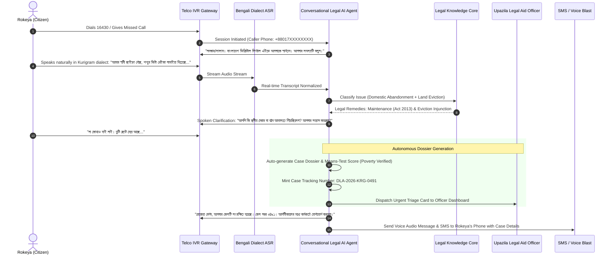
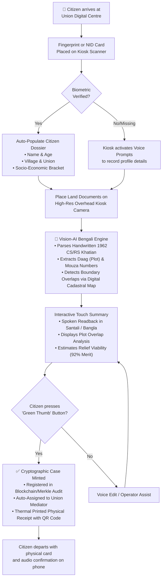
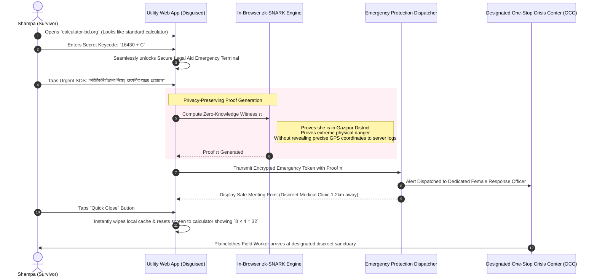
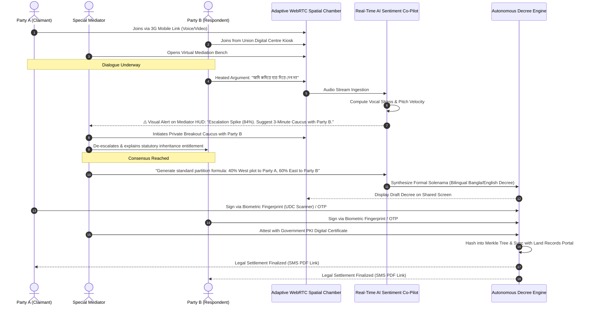
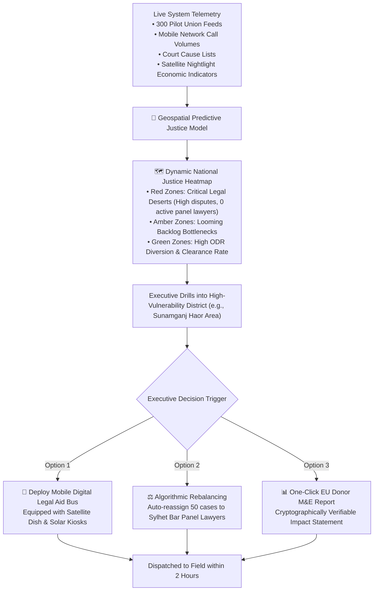

# 🌐 Futuristic User Flow Document
## Human-Centered Autonomous Legal Journeys (DLA-Nexus Experience)

---

| **Field**                 | **Specification**                                                                 |
|---------------------------|-----------------------------------------------------------------------------------|
| **Project Name**          | Accelerating Digital Legal Aid Services in Bangladesh (DLA-Nexus)                 |
| **Document Version**      | v3.0-Futuristic Experience Edition                                                |
| **UX Design Philosophy**  | Zero-Barrier, Voice-First, Neuro-Inclusive, Zero-Knowledge Privacy, Real-Time AI  |
| **Primary Beneficiaries** | 682,500+ Citizens (Rural Women, Illiterate Workers, PwDs, Indigenous Minorities) |
| **Supported Modalities**  | Conversational Voice, Smart Kiosks, WhatsApp AI, Web PWA, Spatial ODR Chambers   |

---

## 1. Experiential User Archetypes & Multimodal Entry Points

```
┌──────────────────────────────────────────────────────────────────────────────────────────────────┐
│                                 MULTIMODAL USER ENTRY MATRIX                                     │
├───────────────────────┬───────────────────────────┬──────────────────────────────────────────────┤
│ BENEFICIARY PROFILE   │ HARDWARE ECOSYSTEM        │ ADAPTIVE INTERACTION MODALITY                │
├───────────────────────┼───────────────────────────┼──────────────────────────────────────────────┤
│ Illiterate Rural Cit. │ 2G Button Phone (PSTN)    │ Conversational Dialect Voice Agent (IVR)     │
│ Rural Land Disputant  │ UDC Touch Kiosk           │ Biometric Touch + Vision AI Document Scanner │
│ GBV Survivor          │ Low-End Smartphone        │ Stealth Web App with Zero-Knowledge Shield   │
│ Indigenous Youth      │ Android / WhatsApp        │ WhatsApp AI Chatbot with Voice-Note Parser   │
│ Panel Lawyer          │ Tablet / Laptop           │ Lawyer Copilot & Automated Honorarium Wallet │
│ Special Mediator      │ Browser / WebRTC          │ AI-Augmented Virtual Mediation Chamber       │
│ Judicial Leadership   │ Holographic / Spatial Tab │ Real-Time Geospatial Justice Heatmap Cockpit │
└───────────────────────┴───────────────────────────┴──────────────────────────────────────────────┘
```

---

## 2. Flow 1: Conversational Bengali Voice AI Intake (Zero-Literacy Journey)

> **Persona**: Rokeya Begum (38, Illiterate, land dispossession by in-laws, 2G button phone).  
> **Channel**: Toll-free PSTN dial-in (`16430`) or automated missed-call callback.  
> **Core Innovation**: No typing, no forms, no screens. Pure dialect-adaptive spoken dialogue.



---

## 3. Flow 2: Zero-Touch UDC Kiosk with Vision-AI Document Parsing

> **Persona**: Santona Murmu (21, Indigenous Youth, disputed ancestral land boundary).  
> **Channel**: Union Digital Centre (UDC) Solar-Powered Edge Kiosk.  
> **Core Innovation**: Optical Character Recognition on century-old handwritten revenue deeds (*Khatian/Porcha*).



---

## 4. Flow 3: Zero-Knowledge Domestic Violence Emergency Protection

> **Persona**: Shampa Akhter (27, Survivor of Gender-Based Violence under spousal phone surveillance).  
> **Channel**: Stealth Web App disguised as a functional Calculator / Utility tool.  
> **Core Innovation**: Local Zero-Knowledge proof generation; zero browser history traces; instant emergency sanctuary dispatch.



---

## 5. Flow 4: Panel Lawyer AI Copilot & Automated Honorarium Journey

> **Persona**: Adv. Anisur Rahman (Panel Lawyer representing legal aid clients in District Court).  
> **Channel**: DLA Lawyer Copilot Mobile/Desktop App.  
> **Core Innovation**: AI statutory research, automated petition generation, automated milestone honorarium release.

```mermaid
flowchart TD
    A["🔑 Lawyer logs in via Passkey / WebAuthn"] --> B["📋 Lawyer Copilot Dashboard<br/>Active Cases: 14 | New Assignments: 1"]
    
    B --> C["Review New Assignment: DLA-2026-KRG-0491<br/>Client: Rokeya Begum (Land Dispossession)"]
    
    C --> D["🤖 AI Case Brief Synthesizer<br/>• Summarizes Voice Intake Transcript<br/>• Identifies Key Evidentiary Gaps<br/>• Suggests Precedents from Supreme Court Law Reports (BLD/DLR)<br/>• Drafts Injunction Petition in formal Bengali"]

    D --> E{"Lawyer Review & Edit"}
    E --> F["Lawyer refines draft & clicks<br/>'E-File to District Court MIS'"]

    F --> G["Case E-Filed in Court Record"]
    
    G --> H["⚖️ Court Hearing Completed<br/>Lawyer records 30-sec voice debrief:<br/>'Interim stay order granted for 60 days'"]

    H --> I["AI transcribes voice memo<br/>& parses Court Daily Cause List"]

    I --> J{"Court Attendance<br/>Verified?"}
    J -->|Verified via Court API| K["💸 Milestone Verified: Appearance Fee<br/>Instant Micro-Disbursement to Lawyer's<br/>bKash/Nagad Wallet: BDT 2,500"]
    
    K --> L["Client Rokeya receives instant SMS update:<br/>'আইনজীবী আপনার পক্ষে ৬০ দিনের স্থগিতাদেশ পেয়েছেন'"]
```



---

## 6. Flow 5: Spatial Online Dispute Resolution (ODR) & Smart Agreement

> **Persona**: Sharmin Sultana (Special Mediator), Disputants A & B.  
> **Channel**: Adaptive WebRTC ODR Chamber.  
> **Core Innovation**: Real-time de-escalation sentiment radar, automated bilingual compromise drafting, multi-party cryptographic signing.



---

## 7. Flow 6: Real-Time Executive Spatial Justice Cockpit

> **Persona**: Director of DBLA & Supreme Court Registrar.  
> **Channel**: High-Level Geospatial Interactive Command Center.  
> **Core Innovation**: Satellite and socioeconomic data integration to predict legal deserts.



---

## 8. Summary of Futuristic UX Enhancements

| User Touchpoint | Legacy Digital System (2020-2024) | DLA-Nexus 3.0 Experience (2025–2028+) |
|:---|:---|:---|
| **Intake Mechanism** | Complex 8-page English/Bangla web forms | Conversational Bengali Dialect Voice AI on any phone |
| **Document Submission** | Manual scanning and desktop PDF upload | Vision AI parsing handwritten 60-year-old land records |
| **Gender-Based Violence** | Public physical queue at government offices | Zero-Knowledge encrypted stealth emergency shelter flow |
| **Dispute Resolution** | Multi-year courtroom physical appearances | Low-bandwidth WebRTC virtual mediation with AI co-pilot |
| **Lawyer Compensation** | Slow, paper-based bureaucratic invoicing | Automatic MFS micro-disbursement upon verified hearing |
| **Monitoring & Oversight** | Annual delayed retrospective PDF reports | Real-time geospatial predictive justice command cockpit |

---

*User Flow Approved for Intuitive, Inclusive, and Transformative Justice Delivery*  
*Accelerating Digital Legal Aid Services in Bangladesh Project (EU / DBLA / UNDP)*
